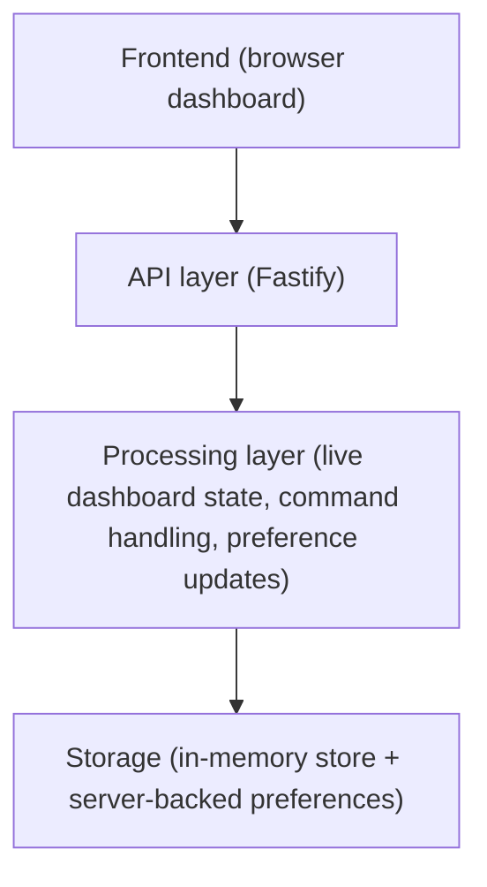
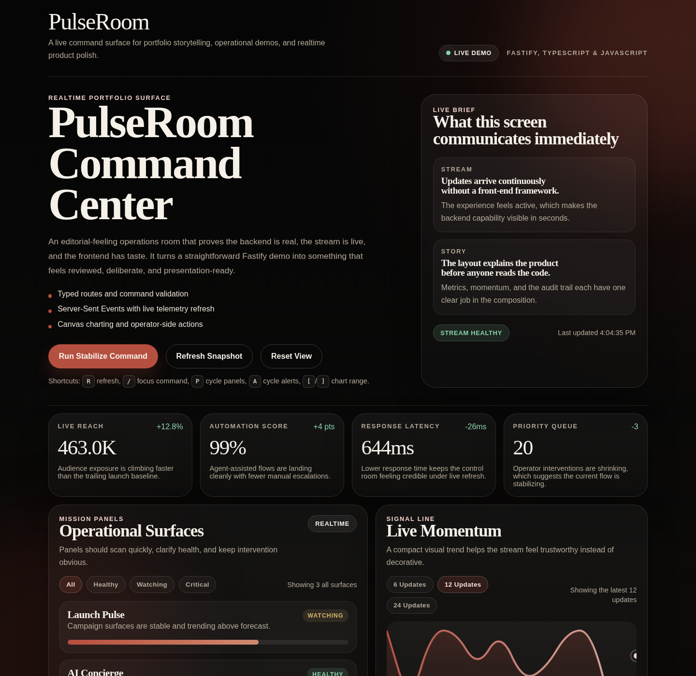
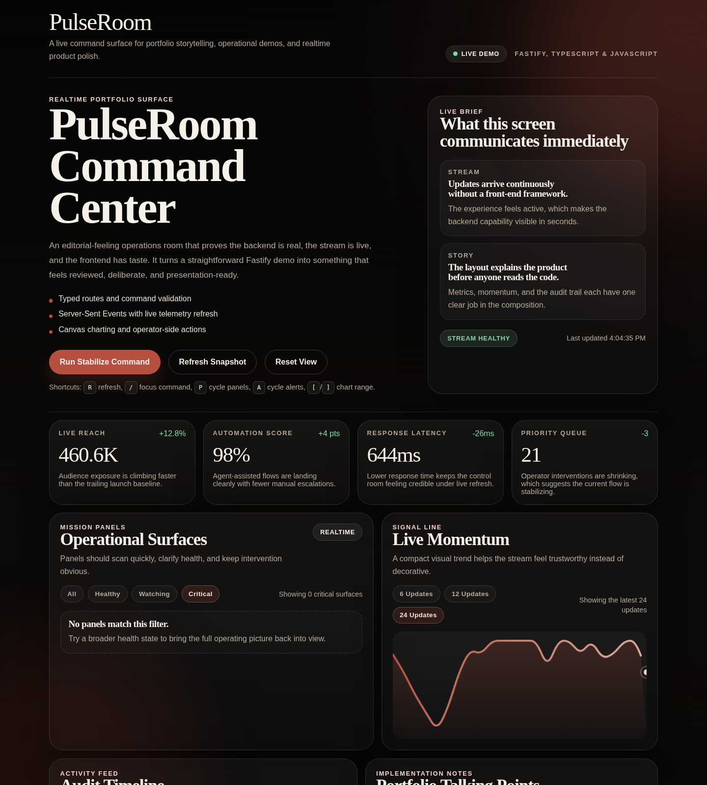
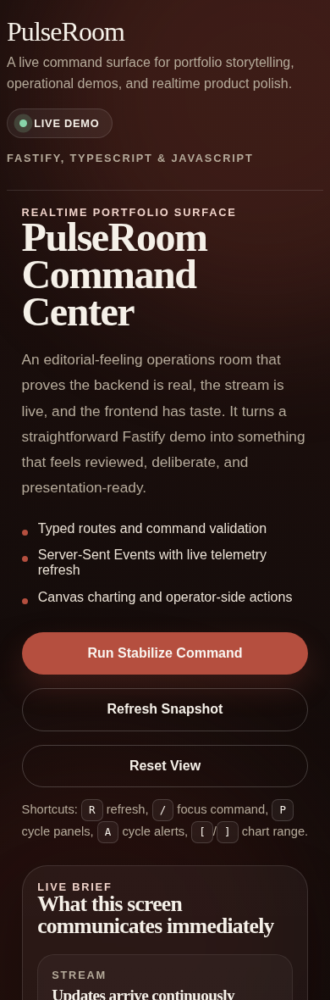

# PulseRoom Command Center

PulseRoom Command Center is a production-style real-time operations dashboard built to present live system activity in a way that feels clear, fast, and actionable. It brings together streaming data, health monitoring, operational filtering, and operator commands in a single command-center interface.

## What this project demonstrates

- Real-time data handling with live streaming updates
- System monitoring and operational UI design
- Scalable backend and frontend architecture for dashboard products
- Product polish through filtering, keyboard control, persistence, and responsive behavior

## Use case

This type of system is commonly used for:

- SaaS monitoring dashboards
- IoT and telemetry interfaces
- Internal operations tools
- Trading and analytics platforms

## Why this matters

This type of system is useful for:

- SaaS platforms needing real-time operational visibility
- Internal operations tools that require fast signal detection
- Monitoring and analytics systems where live updates drive action
- Teams that need a single interface for status, filtering, and response

## Key capabilities

- Streaming dashboard refreshes over Server-Sent Events
- Metric cards with contextual annotations
- Mission panels with health states and progress bars
- Live activity timeline with severity levels
- Canvas-based sparkline for momentum tracking
- Operator command form that injects new events into the stream
- Filter controls for panels, activity, and chart range
- Keyboard shortcuts for fast operator workflows
- Server-backed view preferences that survive refreshes during local use

## Architecture overview

The system is designed as a real-time operational dashboard:



Real-time updates via:

- Server-Sent Events (SSE)

## Screenshots

### Desktop overview



A wide desktop view of the command center showing the editorial hero, metric layer, and the main operational surfaces.

### Filtered operator state



A focused dashboard state that highlights the filter controls for panel health, activity severity, and the expanded chart range.

### Mobile responsive view



A narrow-screen capture that shows how the layout stacks cleanly while keeping the dashboard readable and usable on mobile.

## Tech stack

- Fastify for the HTTP server and API routes
- TypeScript for backend modeling, route contracts, and state management
- JavaScript for client-side rendering and interactions
- Server-Sent Events for the live dashboard stream
- Canvas API for sparkline rendering
- Static asset hosting through Fastify for a compact full-stack setup

## Experience highlights

- Strong visual hierarchy in the hero and section layout
- Metric descriptions that communicate meaning instead of raw numbers only
- Filter chips with visible active state
- Live stream status and last-updated feedback
- Resettable dashboard view state
- Accessible progress bars and aria-live feedback for form responses
- Responsive layouts that remain usable on smaller screens

## Keyboard shortcuts

The dashboard supports a small operator-style shortcut set:

- `R` refresh the snapshot
- `/` focus the command label field
- `P` cycle panel health filters
- `A` cycle activity severity filters
- `[` move to a shorter chart range
- `]` move to a longer chart range
- `Esc` leave the focused input field

## API surface

- `GET /api/health` returns a simple service health payload
- `GET /api/dashboard` returns the current dashboard snapshot
- `GET /api/preferences` returns saved dashboard view preferences for the current client id
- `PUT /api/preferences` updates saved dashboard view preferences
- `POST /api/commands` validates and logs an operator command
- `GET /api/stream` pushes live dashboard updates over SSE

## Local development

Install dependencies and start the development server:

```bash
npm install
npm run dev
```

Then open [http://localhost:4180](http://localhost:4180).

If you prefer running the compiled server directly:

```bash
npm run build
npm start
```

## Architecture snapshot

- `src/server.ts` handles Fastify setup, static hosting, SSE streaming, and fallback routing
- `src/routes/api.ts` contains API routes, request validation, and preference endpoints
- `src/lib/store.ts` manages typed dashboard state and in-memory preference storage
- `public/index.html`, `public/app.js`, and `public/styles.css` drive the client experience
